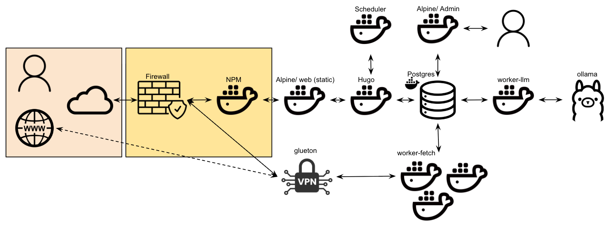

# SemperVigil Architecture

> **Current runtime notes:** see [CURRENT_CONTEXT.md](CURRENT_CONTEXT.md) before troubleshooting or starting a new chat.

> **Canonical architecture specification**
>
> This document is the authoritative reference for SemperVigil’s design.
> All implementation work (human or Codex) must conform to it.

---

## DO NOT DEVIATE

These rules are invariant unless explicitly approved and logged in `docs/CHANGELOG.md`.

- **Vendor/Product data** must be stored ONLY in:
  `vendors`, `products`, `article_products`, `cve_products`, `cve_product_versions`.
  Vendor/product data must NEVER be encoded as tags.
  Unknowns are represented by absence of links (no sentinel rows).
- **Threat actors** must be stored ONLY in:
  `threat_actors`, `threat_actor_aliases`, `article_threat_actors`, `cve_threat_actors`.
  Unknowns are represented by absence of links (no sentinel rows).
- **Topical tags** must be stored ONLY in `article_tags` (tag_type = topical).
  They must never include `vendor:*` or `product:*`.
- **Build pipeline** remains the portable compose pipeline (no hardcoded `/nfs`).
 - **Daily Briefs** are topic-first and JSON-driven. The pipeline must use Pipeline Routing stages only:
   - `daily_brief_cluster_topics`
   - `daily_brief_summarize_topics`
   - `daily_brief_map_nist_families`
   - `daily_brief_overall_synthesis`
   No hardcoded prompts inside job handlers.
  Do not change build scripts in this task.

---

## 0. Architecture Overview

SemperVigil is a **database-orchestrated ingestion and publishing system** with strict
separation between public access, internal control, and worker execution.

Only a single component is exposed to the public internet. All orchestration,
state, and coordination occurs internally via PostgreSQL.

### Architecture Diagram

> **NOTE:** This diagram is canonical.  
> Any implementation or refactor must preserve these trust boundaries and flows.

### SemperVigil System Architecture Diagram
(File: docs/architecture/sempervigil-architecture.png)

---

## 0.1 Trust Zones

- **Public / Internet**
  - Untrusted users and networks
- **DMZ / Edge**
  - Internet-facing reverse proxy only
- **Internal Control Plane**
  - Configuration, orchestration, and build control
- **Internal Workers & Data Plane**
  - Stateless workers and core data store
- **External Dependencies**
  - Outbound-only services (e.g., VPN egress, LLM inference)

---

## 0.2 Object Legend

### Public / Internet

#### Public User
Represents any external user accessing the SemperVigil website via a browser.
Has no access to internal services, databases, or administrative interfaces.

#### Public Internet / Cloud
Untrusted external network through which all public access originates.

---

### DMZ / Edge

#### Firewall
Network boundary that port-forwards inbound traffic to Nginx Proxy Manager.
No application logic is exposed at this layer.

#### Nginx Proxy Manager (NPM)
The **only internet-exposed container**.
Acts as a reverse proxy routing HTTP(S) traffic to the internal `web` container.
Has no database access and no awareness of internal jobs or state.

---

### Internal Control Plane

#### web (Static Site)
Serves Hugo-generated static content.
Reads files from an internal NFS share populated by the Hugo builder.
Has no database access and executes no jobs.

#### Admin
Internal-only administrative interface used by trusted operators.
Used to manage configuration, define sources, and enqueue jobs.
Reads from and writes to PostgreSQL.
Never exposed to the public internet.

#### Postgres Database
The **central coordination and state store** for the entire system.
Maintains:
- job queues
- configuration
- raw fetched content
- enriched summaries
- build state

All services interact **through Postgres**, not directly with each other.

#### Discovery / Orchestrator
Singleton internal control-plane role.
Monitors Postgres for queue depth, due source checks, scheduled work, and build-dirty state.
Enqueues stage launch jobs and admits `build_site` only when policy allows.

#### Stage Runners
Lightweight internal execution launchers for:
- fetch
- llm_local
- openai
- build

Each runner claims a control-plane launch job, runs a bounded stage worker pass, and exits the child worker process when the assigned batch or time limit is reached.

#### Build Worker
Executes admitted `build_site` jobs only.
Generates the static site from content stored in Postgres and `site-src`.
Outputs files to a shared NFS location consumed by the `web` container.
Does not serve content directly.

---

### Internal Workers & Data Plane

#### worker-fetch (Scaled via runner launches)
Stateless acquisition workers that pull fetch-stage jobs from Postgres during bounded runner-directed passes.
Retrieve external content (RSS, HTML, feeds).
Write raw content and metadata back to Postgres.
Designed for horizontal scaling.
Fetchers support HTTP/2 curl with Range prefixing for RSS endpoints that
stall under Python HTTP stacks; per-source overrides can force fetcher/timeout.

#### VPN
Outbound-only network path used exclusively by `worker-fetch`.
Ensures acquisition traffic exits through a controlled egress point.
No inbound access and no use by admin, web, or LLM workers.

#### worker-llm
Stateless enrichment worker that pulls only local-LLM-stage jobs from Postgres during bounded runner-directed passes.
Performs:
- summarization
- vendor identification
- product and event extraction

Writes structured results back to Postgres.

#### Ollama
Internal Large Language Model inference service used by `worker-llm`.
Provides local LLM execution without external API dependency.
Not exposed to the public internet.

---

### Flow Semantics

- **Solid arrows** indicate internal data or job flow mediated by Postgres.
- **Dashed arrows** indicate outbound or external dependency communication.
- **Stacked worker icons** indicate horizontally scalable services.

---

## 1. Purpose

SemperVigil is a configurable, source-agnostic news and intelligence aggregation
platform designed to provide:

1. **Breadth** – Daily visibility into what many sources are reporting.
2. **Depth** – Aggregated understanding of events, themes, and vulnerabilities.
3. **Continuity** – Persistent memory of incidents, CVEs, and evolving narratives.
4. **Explainability** – Evidence, confidence, and attribution for all inferences.
5. **Operational safety** – Deterministic scraping, health tracking, and backoff.

---

## 2. Core Objects

### 2.1 Articles (Breadth Layer)

Articles represent **individual source publications**.

**Rules**
- Every accepted article is published as a daily post.
- Articles preserve original URLs and attribution.
- Articles are immutable once ingested.

**Core Fields**
- `article_id`
- `source_id`
- `title`
- `canonical_url`
- `published_at`
- `ingested_at`
- `tags`
- `content_fingerprint` (for grouping, not dedupe deletion)

**Relationships**
- One **primary event**
- Zero or more **secondary events**

Commercial / sponsored content is filtered deterministically.

---

### 2.2 Events (Depth Layer)

Events are **living narrative objects** that aggregate articles over time.

**Event Types**
- `CVE` – CVE-YYYY-NNNN
- `INCIDENT` – breaches, campaigns, outages
- `META` – umbrella groupings (MITRE-like)

**Event Properties**
- Stable `event_key`
- Timeline of updates
- Many-to-many relationship with articles
- Confidence-scored inferences

Events evolve; they are never rewritten in place.

---

## 3. Event Summaries

- Summaries are **event-based**, not article-based.
- Stored as **versioned records**.
- A new version is created when:
  - new articles are linked
  - CVE severity changes
  - analyst or LLM update occurs

The latest version is marked as `current_summary`.

---

## 4. CVEs as First-Class Objects

### 4.1 CVE Ingestion

- CVEs pulled from **NVD API**.
- Default polling: **hourly** (configurable).
- Queries use:
  - published date
  - last modified date

### 4.2 CVSS Handling

- Capture **CVSS v4.0** and **CVSS v3.1** when available.
- Prefer **v4.0** for headline severity.
- Persist **full metric breakdowns**.

### 4.3 Severity Tracking

- CVE records are snapshotted.
- Diffs are computed per update.
- Severity upgrades are highlighted.
- Metric-level diffs explain *why* a change occurred.

---

## 5. Vulnerability Surface Modeling

Each CVE stores:

- Vendor
- Product
- Affected versions (best-effort)
- CWE IDs
- Normalized vulnerability type taxonomy
- Reference URLs

This enables **article-to-CVE matching even without explicit CVE mentions**.

Confidence scores are applied to inferred matches.

---

## 6. Article → Event Correlation

### 6.1 Deterministic Matching (Primary)

- Explicit CVE IDs
- Vendor + product + vuln type
- Known campaign / incident identifiers

### 6.2 Heuristic Matching (Secondary)

- Keyword clusters
- Affected component overlap
- Temporal proximity

### 6.3 LLM-Assisted Matching (Fallback)

- Used only when deterministic methods fail
- Prompted with:
  - article excerpt
  - candidate events
- Output must include:
  - confidence score
  - justification
  - uncertainty flag

---

## 7. Source System

### 7.1 Sources

Sources are stored **only in the database**, not config files.

**Source Properties**
- `source_id`
- `name`
- `base_url`
- enabled / disabled
- scrape frequency (default: hourly)
- allowed scrape tactics
- ToS / robots notes

### 7.2 Per-Source Scraping Tactics

Each source may support multiple tactics:

- RSS / Atom
- JSON feeds
- HTML index parsing
- Sitemap parsing
- Article page scraping

Tactics are:
- individually enabled / disabled
- ordered by preference
- health-scored

---

## 8. Scraping Analysis & Recovery

When a source yields zero articles or parse failures:

1. Record failure statistics
2. Pause scraping automatically
3. Flag source as unhealthy
4. Allow **analysis mode**:
   - inspect raw HTML
   - identify candidate selectors
   - optionally generate an LLM prompt (manual execution)

No automatic LLM calls for scraping.

---

## 8.1 Source Overrides (Per-Source)

Overrides let us tune discovery + content extraction for problematic sources without changing the global pipeline.

### 6.4 Daily Brief (Topic-First)
Daily Briefs are generated from **today’s accepted articles** and clustered into topics.
The brief is synthesized from topics (not raw per-article summaries) and grouped by
NIST 800-53 families. Output is published to Hugo / nginx as:
- daily brief content pages under `content/daily-briefs/YYYY-MM-DD.md`
- homepage feed data exposed at `/feed/index.json` and `/feed/days/YYYY-MM-DD.json`
- historical feed JSON stored outside the Hugo release tree under `SV_FEED_ARCHIVE_DIR`
  (production: `/site/shared/feed`) so unchanged day files are reused instead of copied
  into every atomic Hugo release

Pipeline stages (via Admin > AI Config) are the **only** control plane for prompts:
- `daily_brief_cluster_topics`
- `daily_brief_summarize_topics`
- `daily_brief_map_nist_families`
- `daily_brief_overall_synthesis`

The brief renderer reads from the daily brief content page and homepage feed/day JSON.
Per-article markdown remains disabled by default.
If overrides are unset, behavior is unchanged.

Stored in `sources.overrides` (JSONB) with this schema:

```
overrides.discovery:
  mode: "default" | "rss_only"
  allowlist_regex: optional string
  blocklist_regex: optional string

overrides.content:
  mode: "default" | "jsonld_articlebody" | "readability" | "trafilatura" | "css_selectors"
  min_chars: int (default 800)
  include_selectors: [string] (default [])
  exclude_selectors: [string] (default [])
  strip_patterns: [string] (default [])
  allow_fallback_to_default: bool (default true)
```

Example (wired.com):

```
discovery:
  mode: rss_only
  allowlist_regex: ^https://www\.wired\.com/story/
  blocklist_regex: /(tag|category|author|newsletter|subscribe|account|search|video|podcast)/
content:
  mode: jsonld_articlebody
  min_chars: 800
```

---

## 9. Configuration & Profiles

SemperVigil supports **build profiles**:

Examples:
- Cybersecurity
- Finance
- Fan News
- General News

Profiles control:
- enabled sources
- CVE ingestion
- tagging vocabularies
- summary behavior

Configured via **settings UI**, not code.

---

## 10. Health, Metrics, and Alerts

### 10.1 Metrics Stored in DB

- articles/day per source
- acceptance ratio
- parse failures
- zero-article days
- latency

### 10.2 Alerts

- Email alerts on:
  - repeated failures
  - zero-article streaks
  - CVE severity upgrades
- Failed sources auto-paused to prevent hammering.

---

## 11. Storage Architecture

### 11.1 Postgres (Required)

Postgres is required because:
- low write contention
- mostly append-only
- safe concurrent writers with row-level locking

Expected scale:
- 100k–300k articles
- multi-year CVE history
- summaries only (no raw HTML)

### 11.2 Migration Notes

Postgres is the required runtime database. Use environment-provided credentials
and ensure migrations are applied before starting workers.

---

## 12. Publishing Model

### Daily Output
- Chronological article feed
- Links only (no duplicate summaries)

### Aggregated Output
- Event pages
- CVE pages
- Timeline-based summaries

---

## 13. Design Principles

- Deterministic first
- Evidence over inference
- Confidence always visible
- Never DOS a source
- Architecture over refactor

---

## 14. This Document

- This file is **source of truth**
- Codex prompts must reference it
- Changes require intentional updates
#### worker-openai
Stateless worker for OpenAI-backed editorial or synthesis stages.
Initially serialized by orchestrator policy.
Processes only openai-stage jobs during bounded runner-directed passes.
